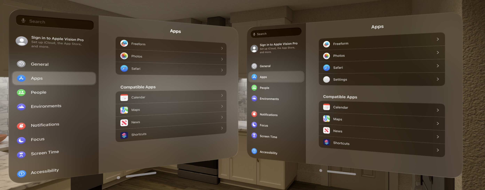

# Settings-visionOS
A **work-in-progress** SwiftUI recreation of the visionOS Settings app.

> [!NOTE]  
> This project is focused on the latest public releases of visionOS and Xcode. Use an older branch for older versions.

## Information
- Based on visionOS 26.2 (23N301).
- All features within the app are only simulations and have no effect on the device outside of the app.
- Layout is based on Simulator and not a physical Apple Vision Pro (for now).
- Previous versions are available as separate branches, going as far back as 1.0. Fewer features are available in earlier versions.

> [!CAUTION]
> Some parts of this project may rely on private APIs. It is strictly for demonstration purposes only.
>
> **Do not reuse any code from this project that relies on private methods.** Consider publicly supported alternatives instead.

## Preview

## Usage
Open in Xcode and run with either Simulator or a physical Apple Vision Pro with Developer Mode enabled as a destination.

> [!IMPORTANT]  
> You may need to change the bundle identifier of the app to be able to sign it with Xcode for use on a physical device.

## Disclaimers
- This app is a personal and educational recreation of Apple's apps and designs, made in appreciation of the teams that built and maintain them.
- All assets including icons, images, localization strings, and other resources are not my own in any way.
- If you have any questions or feedback, please contact me through the options listed on my profile.

## Other Settings Projects
- **macOS System Settings** https://github.com/zhrispineda/System-Settings
- **iOS & iPadOS Settings** https://github.com/zhrispineda/Settings-iOS
- **watchOS Settings** https://github.com/zhrispineda/Settings-watchOS
- **tvOS Settings** https://github.com/zhrispineda/Settings-tvOS
